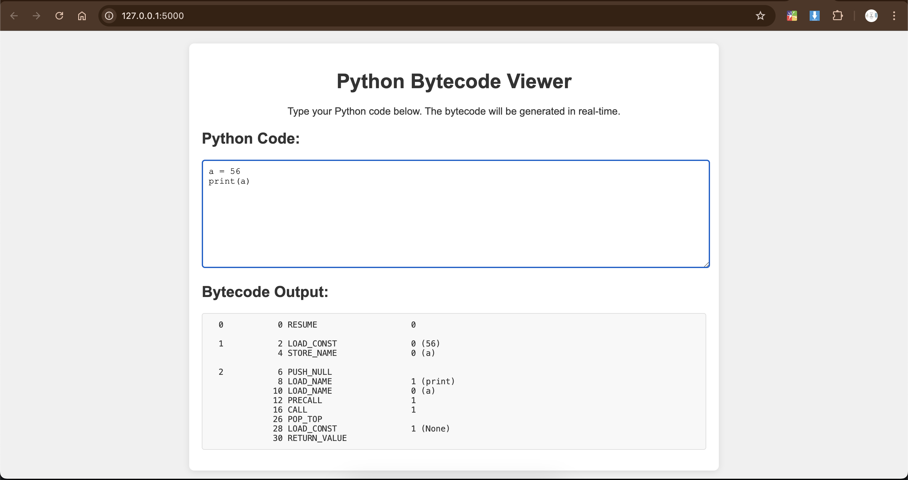

# Python Bytecode Viewer

A web app that shows the bytecode of Python's source code in real-time as you type.



## Features

- Type Python code in a text area.
- View the corresponding bytecode instantly.
- Built using Flask for a smooth user experience.
- **Soon to include Gemini API for understanding bytecode elements and their meanings.**

## How to Run

1. Clone the repository:
   ```bash
   git clone https://github.com/chiragjoshi12/python-bytecode-viewer.git
    ```

2. Navigate to the project directory:
    ```bash
    cd python-bytecode-viewer
    ```

3. Install the required packages:
    ```bash
    pip install -r requirements.txt
    ```

4. Run the app:
    ```bash
    python app.py
    ```

5. Open your browser and go to `http://127.0.0.1:5000`.

---

Readme made with 💖 using [README Generator by Chirag Joshi](https://github.com/chiragjoshi12/readme-generator)